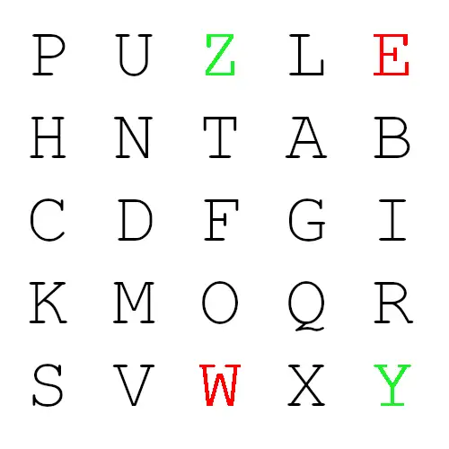
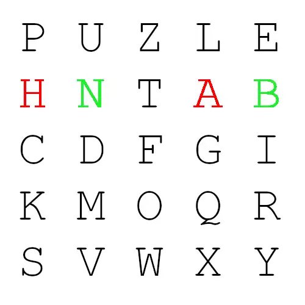
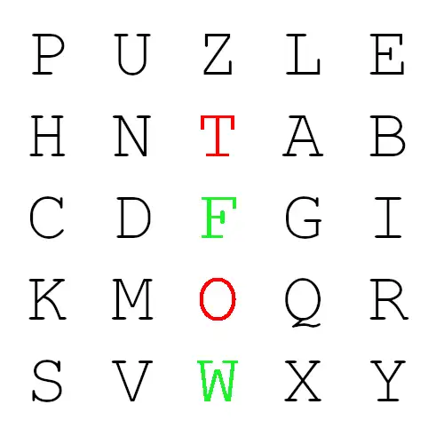

别称： Playfair Square

## 转换方式

普莱费尔密码的加密需要用到一个 5 × 5 的字符方阵。通常制作方法为选取一串英文字母，除去重复出现的字母，
将剩下的字母逐个逐个加入 5 × 5 的方阵内，剩下的空间由未加入的英文字母依 a-z 的顺序加入。

以 `PUZZLEHUNT` 为密钥，生成的字符方阵为：

```plain title="Playfair 加密方阵"
P U Z L E
H N T A B
C D F G I
K M O Q R
S V W X Y
```

因为 26 个英文字母不可能都放进 5 × 5 的方阵，这里我们采用常用的将 I 与 J 视为同一字的方法。
其他生成方法请参考“变种”。

拥有字符方阵后，我们将想要加密的明文分成两个字母一组，若组内的字母相同，将 X 加到该组的第一个字母后，重新分组。
若剩下一个字，也加入 X 。(1)
{.annotate}

1. 也有使用 Q 的用法，总之尽量选择不太常用的字母。

之后进行加密，对于每两个字母，按照如下流程将其转换成另外两个字母：

1. 找出两个字母在方阵中的位置。
2. 若两个字母不同行也不同列，在方阵中找出另外两个字母（第一个字母对应行优先），使这四个字母成为一个长方形的四个角。
    <figure markdown>
        {width="200"}
        <figcaption markdown>加密 `WE` 可以得到 `ZY` </figcaption>
    </figure>
3. 若两个字母同行，取这两个字母右方的字母（若字母在最右方则取最左方的字母）。
    <figure markdown>
        {width="200"}
        <figcaption markdown>加密 `HA` 可以得到 `NB` </figcaption>
    </figure>
4. 若两个字母同列，取这两个字母下方的字母（若字母在最下方则取最上方的字母）。
    <figure markdown>
        {width="200"}
        <figcaption markdown>加密 `TO` 可以得到 `FW` </figcaption>
    </figure>

新找到的两个字母就是原本的两个字母加密的结果。

## 加密举例

明文： `WELCOME TO PUZZLE HUNT WIKI CN`

加密方阵：

```plain title="Playfair 加密方阵"
P U Z L E
H N T A B
C D F G I
K M O Q R
S V W X Y
```

密文： `YZPGQOZBKZZLLEPBNDFZCRCDAV`

## 识别方式

普莱费尔密码很难从密文直接看出其加密方式，其线索较为有限：

- 密文一定是偶数个字母
- 密文一定不会超过25种字母
- 密文的每两个字母一定不相同
- 密文的每两个字母一定不会出现在对应的明文字母里

## 历史

普莱费尔密码由英国人查尔斯·惠斯通 ( Charles Wheatstone ) 创作，命名来自于他的好友莱昂·普莱费尔男爵。

## 解码工具

- [dCode](https://www.dcode.fr/playfair-cipher)
