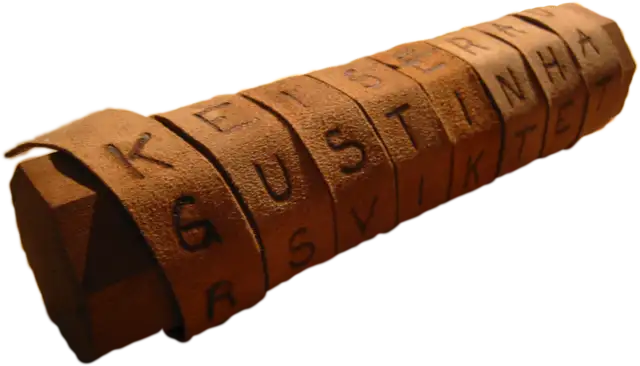

别称： Caesar Box

## 加密方式

密码棒属于移位密码的一种。想象一下你拿着一条很长的绷带，斜着缠绕在一根圆柱体的棒子上。

<figure markdown>
  { width="200" }
  <figcaption markdown>密码棒&nbsp;[^1]
  </figcaption>
</figure>

你再这条绷带上横着写下内容，然后将绷带解开，传递给对方。对方有一根跟你一样直径的棒子，就可以将绷带缠绕在他的棒子上还原你的信息。

密码棒加密就是上面这种加密方式的电子版，它的操作有点类似[栅栏密码](./railfence.md)。
首先想象你的棒子的“直径”（密钥），也就是每缠绕一圈能有几个字母。

之后，将明文分成“直径”段，每一段横着写下，然后再“解开绷带”，即竖着读取。

有些时候密钥描述的不是每缠绕一圈的字母数，而是一共缠绕了几圈，这点在使用解码工具的时候需注意。

## 加密举例

明文： `WELCOME TO PUZZLE HUNT WIKI CN`

密钥： 3

密文： `WPTEUWLZICZKOLIMECEHNTU·ON·`

这里的中点 · 是由于最后剩下两个空字符导致的。

??? tip "说些闲话"
    其实这种“电子”密码棒的加密与解密才是国内意义的“栅栏密码”。
    密码棒的加密与解密可以看作是不用进行排序的列位移密码。

## 解码工具

- [dCode](https://www.dcode.fr/scytale-cipher)

[^1]: [Wikimedia Commons](https://commons.wikimedia.org/wiki/File:Skytale.png)
