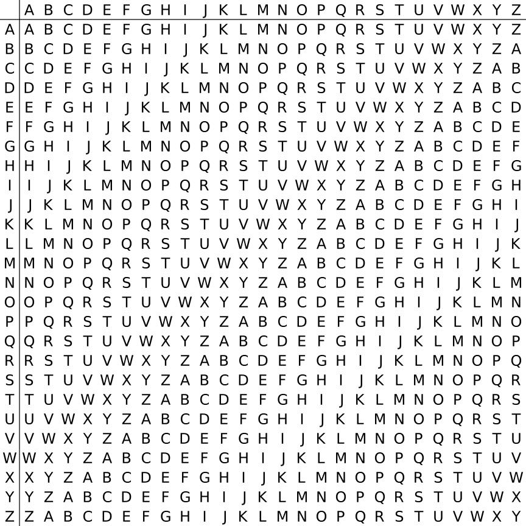

## 加密方式

维吉尼亚密码是经典的替换式密码。对比其他替换式密码，其破译难度相对较高，因而更有知名度。

维吉尼亚密码可以看作是若干个不同的[凯撒密码](./caesar.md)的结合。每个凯撒密码的移位组成了维吉尼亚密码的密钥。

举例来说，密钥为 1, 14, 19，便是将明文第一个字母按 1 位凯撒加密，第二个字母按 14 位凯撒加密，第三个字母按 19 位凯撒加密，
第四个字母用回 1 位凯撒加密，以此类推。密钥是循环使用的。

上面提到的密钥通常使用字母来代替，对应字母为 A 在经过凯撒移位后的新字母。上面 1, 14, 19 的密钥便是 BOT。

为了方便进行加密与解密工作，常用以下表格进行加密与解密工作。找到明文字母所在的行与密钥所在的列，行列之间的交点便是需要加密的字符。
类似的，通过找到密钥所在的列，并找到那一行的密文字母，所在的那一行便是对应的明文字母。

<figure markdown>
  { width="300" }
  <figcaption markdown>维吉尼亚方阵</figcaption>
</figure>

## 加密举例

明文： `WELCOMETOPUZZLEHUNTWIKICN`

密钥： `CIPHER`

扩充： `CIPHERCIPHERCIPHERCIPHERC` （循环使用密钥，扩充至明文长度）

密文： `YMAJSDGBDWYQBTTOYEVEXRMTP`

## 识别方式

破译维吉尼亚密码的关键在于它的密钥是循环重复的。通过猜测密钥长度的方法可以帮助破解维吉尼亚密码。
在 PH 里涉及到维吉尼亚密码通常需要借助工具帮助求解。但如果单纯的暴力会非常没劲，因此 PH 命题人往往会提供线索，
帮助玩家找到维吉尼亚密码的密钥，从而能够“聪明地”破解维吉尼亚密码。

## 历史

维吉尼亚密码取名自法国外交官布莱斯·德·维吉尼亚，但据说发明他的人另有其人。

1854 年，查尔斯·巴贝奇声称其破解了维吉尼亚密码。1863 年，弗里德里希·卡西斯基第一次向公众发表完整的维吉尼亚密码的破译方法。
卡西斯基的方法又被称为卡西斯基试验。

## 解码工具

- [dCode](https://www.dcode.fr/vigenere-cipher)

## 变种

### Beaufort Cipher 博福特密码

博福特密码将维吉尼亚密码运算密文的方式做出了更改。

维吉尼亚密码是将明文字母作为行，密钥字母作为列，去寻找交叉的字母作为密文字母。
博福特密码是将明文字母作为行，**在这一行中找到密钥字母**，其对应的列作为密文字母。

博福特密码的一个好处是它的加密方法也是解密方法。只要用密钥对着密文字母再操作一次便可得到明文字母。

解码工具： [dCode](https://www.dcode.fr/beaufort-cipher)

### Autokey Cipher 自动密钥密码

别称： Autoclave Cipher

自动密钥密码是维吉尼亚本人发明的。它的特点是在维吉尼亚的基础上修改了密钥，
密钥开头是一个关键词，之后把明文本身接在密钥后面。

举例来说，假设明文是 `WELCOME TO PUZZLEHUNT WIKI CN`，密钥关键词是 `CIPHER`，则自动密钥使用的
维吉尼亚密钥为 `CIPHERWELCOMETOPUZZLEHUNT....`，可以看到密钥把明文接在了关键词后。

自动密钥密码运算密文的方式与维吉尼亚密码一致。

解码工具： [dCode](https://www.dcode.fr/autoclave-cipher)
