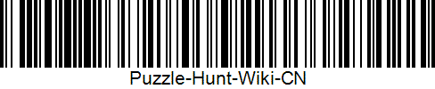

## 条形码

条形码（ barcode ）是将宽度不等的多个黑条和空白，按照一定的编码规则排列，用以表达一组信息的图形标识符。

常见的条形码是由反射率相差很大的黑条（简称条）和白条（简称空）排成的平行线图案。条形码可以标出物品的生产国、制造厂家、商品名称、生产日期、图书分类号、邮件起止地点、类别、日期等信息，因而在商品流通、图书管理、邮政管理、银行系统等许多领域都得到了广泛的应用。

条形码有很多种类，其中常用的一种为 Code-128。下图是使用 Code-128 方法生成的一张条形码。

<figure markdown>
  { width="200" }
  <figcaption markdown>条形码
  </figcaption>
</figure>

## 二维码

二维码也称为二维条码、行动条码，是指在一维条码的基础上扩展出另一维具有可读性的条码，使用黑白矩形图案表示二进制数据，被设备扫描后可获取其中所包含的信息。

最有名的二维码莫过于 QR 码，其特征是三个角落的“回”字图案，又称定位标志。下图是一张 QR 码的示例。

<figure markdown>
  { width="150" }
  <figcaption markdown>QR 码
  </figcaption>
</figure>

## 制作与解读

扫描条形码或二维码可以通过大多数的手机相机进行扫描，很多应用也支持扫描这些条码或图码。

如果您需要生成二维码或者需要在线扫描，可以参考下方的两个工具。

条形码与二维码的生成网站： [barcode.tec-it.com](https://barcode.tec-it.com/zh)

条形码与二维码的在线扫描： [zxing.org/w/decode.jspx](https://zxing.org/w/decode.jspx)
