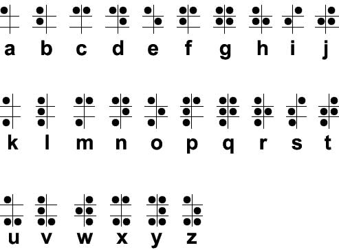

别称： 点字 、 盲字 、 凸字

## 介绍

盲文（ Braille ）是由法国人路易·布莱叶发明的文字，在纸张上制作出不同组合的凸点而组成。

盲文的基本单位是长方形的盲符，有位置固定的六个点，每个点可以凸出或不凸出。

<figure markdown>
  { width="363" }
  <figcaption markdown>盲文
  </figcaption>
</figure>

六个点的分布是左右两行，上中下三层。如图所示，左行自上而下称为 1、2、3 点，右行自上而下称为 4、5、6 点。

<figure markdown>
  { width="155" }
  <figcaption markdown>盲文排列</figcaption>
</figure>

英文盲文字母的特点是 1 点必须有点，如果没有就是 2 和 4 必须有点，这样可以让盲人阅读时有一个原点来判断相对位置。

## 数字

英文盲文表示数字的方法使用了原来的 A ~ J 来代表 1 ~ 9 和 0。为了避免和普通的英文字母混淆，规定在表示数字前
需要加上表示数字的符号：井号 `#`，盲文符号是 `⠼` 。

## 工具

盲文在 PuzzleHunt 中非常常见，属于热门类型，关于盲文的解读可以使用以下工具：

- [焖肉面（盲文&旗语）](https://philippica.github.io/cipher_machine/)

## 变种

除了经典的 6 点盲文以外，各地都产生了一些在盲文基础上的变种。

### 汉语盲文

汉语盲文系统有两种，一种是在 1953 年设计的“现行盲文”，另一种是 1988 年推广的“双拼盲文”，根据《中国盲文》（ GB/T 15720-2008 ），这两种盲文并存使用。

现行盲文是表音文字，汉语的每个音节由一至三方盲符组成，分别表示声母、韵母和声调。双拼盲文用两方盲符表示一个汉语音节。第一方盲符表示声母和介母，称作声方；第二方盲符表示韵母和声调，称作韵方。

以下介绍较为主流使用的“现行盲文”方案字母。现行盲文方案以词为单位书写，词间空出一方。原则上不标调，但有一些例外，具体可前往现行盲文方案查询。

#### 声母

<table markdown>
<tr class="table-horizontal">
<th>声母</th>
<td>b</td>
<td>p</td>
<td>m</td>
<td>f</td>
<td>d</td>
<td>t</td>
<td>n</td>
<td>l</td>
<td>g/j</td>
<td>k/q</td>
<td>h/x</td>
</tr>
<tr class="table-horizontal" markdown>
<th>盲符</th>
<td class="no-padding" markdown>{ width="50" }</td>
<td class="no-padding" markdown>{ width="50" }</td>
<td class="no-padding" markdown>{ width="50" }</td>
<td class="no-padding" markdown>{ width="50" }</td>
<td class="no-padding" markdown>{ width="50" }</td>
<td class="no-padding" markdown>{ width="50" }</td>
<td class="no-padding" markdown>{ width="50" }</td>
<td class="no-padding" markdown>{ width="50" }</td>
<td class="no-padding" markdown>{ width="50" }</td>
<td class="no-padding" markdown>{ width="50" }</td>
<td class="no-padding" markdown>{ width="50" }</td>
</tr>
<tr class="table-horizontal">
<th>声母</th>
<td>zh(i)</td>
<td>ch(i)</td>
<td>sh(i)</td>
<td>r(i)</td>
<td>z(i)</td>
<td>c(i)</td>
<td>s(i)</td>
<td></td>
<td></td>
<td></td>
<td></td>
</tr>
<tr class="table-horizontal" markdown>
<th>盲符</th>
<td class="no-padding" markdown>{ width="50" }</td>
<td class="no-padding" markdown>{ width="50" }</td>
<td class="no-padding" markdown>{ width="50" }</td>
<td class="no-padding" markdown>{ width="50" }</td>
<td class="no-padding" markdown>{ width="50" }</td>
<td class="no-padding" markdown>{ width="50" }</td>
<td class="no-padding" markdown>{ width="50" }</td>
<td></td>
<td></td>
<td></td>
<td></td>
</tr>
</table>

声母的 zh ch sh r z c s 可自成音节，但是它们后面必须要标声调。

#### 韵母

<table markdown>
<thead>
<tr class="table-vertical">
<td>韵母</td>
<td>盲符</td>
<td>韵母</td>
<td>盲符</td>
<td>韵母</td>
<td>盲符</td>
<td>韵母</td>
<td>盲符</td>
</tr>
</thead>
<tbody markdown>
<tr class="table-vertical" markdown>
<td>er</td>
<td class="no-padding" markdown>{ width="50" }</td>
<td>i (yi)</td>
<td class="no-padding" markdown>{ width="50" }</td>
<td>u (wu)</td>
<td class="no-padding" markdown>{ width="50" }</td>
<td>ü (yu)</td>
<td class="no-padding" markdown>{ width="50" }</td>
</tr>
<tr class="table-vertical" markdown>
<td>a</td>
<td class="no-padding" markdown>{ width="50" }</td>
<td>ia (ya)</td>
<td class="no-padding" markdown>{ width="50" }</td>
<td>ua (wa)</td>
<td class="no-padding" markdown>{ width="50" }</td>
<td></td>
<td class="no-padding" markdown></td>
</tr>
<tr class="table-vertical" markdown>
<td>e/o</td>
<td class="no-padding" markdown>{ width="50" }</td>
<td>ie (ye)</td>
<td class="no-padding" markdown>{ width="50" }</td>
<td>uo (wo)</td>
<td class="no-padding" markdown>{ width="50" }</td>
<td>üe (yue)</td>
<td class="no-padding" markdown>{ width="50" }</td>
</tr>
<tr class="table-vertical" markdown>
<td>ai</td>
<td class="no-padding" markdown>{ width="50" }</td>
<td class="no-padding" markdown></td>
<td class="no-padding" markdown></td>
<td>uai (wai)</td>
<td class="no-padding" markdown>{ width="50" }</td>
<td class="no-padding" markdown></td>
<td class="no-padding" markdown></td>
</tr>
<tr class="table-vertical" markdown>
<td>ei</td>
<td class="no-padding" markdown>{ width="50" }</td>
<td class="no-padding" markdown></td>
<td class="no-padding" markdown></td>
<td>ui (wei)</td>
<td class="no-padding" markdown>{ width="50" }</td>
<td class="no-padding" markdown></td>
<td class="no-padding" markdown></td>
</tr>
<tr class="table-vertical" markdown>
<td>ao</td>
<td class="no-padding" markdown>{ width="50" }</td>
<td>iao (yao)</td>
<td class="no-padding" markdown>{ width="50" }</td>
<td class="no-padding" markdown></td>
<td class="no-padding" markdown></td>
<td class="no-padding" markdown></td>
<td class="no-padding" markdown></td>
</tr>
<tr class="table-vertical" markdown>
<td>ou</td>
<td class="no-padding" markdown>{ width="50" }</td>
<td>iu (you)</td>
<td class="no-padding" markdown>{ width="50" }</td>
<td class="no-padding" markdown></td>
<td class="no-padding" markdown></td>
<td class="no-padding" markdown></td>
<td class="no-padding" markdown></td>
</tr>
<tr class="table-vertical" markdown>
<td>an</td>
<td class="no-padding" markdown>{ width="50" }</td>
<td>ian (yan)</td>
<td class="no-padding" markdown>{ width="50" }</td>
<td>uan (wan)</td>
<td class="no-padding" markdown>{ width="50" }</td>
<td>üan (yuan)</td>
<td class="no-padding" markdown>{ width="50" }</td>
</tr>
<tr class="table-vertical" markdown>
<td>en</td>
<td class="no-padding" markdown>{ width="50" }</td>
<td>in (yin)</td>
<td class="no-padding" markdown>{ width="50" }</td>
<td>un (wen)</td>
<td class="no-padding" markdown>{ width="50" }</td>
<td>ün (yun)</td>
<td class="no-padding" markdown>{ width="50" }</td>
</tr>
<tr class="table-vertical" markdown>
<td>ang</td>
<td class="no-padding" markdown>{ width="50" }</td>
<td>iang (yang)</td>
<td class="no-padding" markdown>{ width="50" }</td>
<td>uang (wang)</td>
<td class="no-padding" markdown>{ width="50" }</td>
<td class="no-padding" markdown></td>
<td class="no-padding" markdown></td>
</tr>
<tr class="table-vertical" markdown>
<td>eng</td>
<td class="no-padding" markdown>{ width="50" }</td>
<td>ing (ying)</td>
<td class="no-padding" markdown>{ width="50" }</td>
<td>ong (weng)</td>
<td class="no-padding" markdown>{ width="50" }</td>
<td>iong (yong)</td>
<td class="no-padding" markdown>{ width="50" }</td>
</tr>
</tbody>
</table>

韵母均可以自成音节。

#### 声调

注：这里的阴平、阳平、上声、去声分别指一至四声。

<table markdown>
<tr class="table-horizontal">
<th>声调</th>
<td>阴平</td>
<td>阳平</td>
<td>上声</td>
<td>去声</td>
<td>清声</td>
</tr>
<tr class="table-horizontal" markdown>
<th>盲符</th>
<td class="no-padding" markdown>{ width="50" }</td>
<td class="no-padding" markdown>{ width="50" }</td>
<td class="no-padding" markdown>{ width="50" }</td>
<td class="no-padding" markdown>{ width="50" }</td>
<td>不标</td>
</tr>
</table>

#### 其他汉语盲文

除了上面两种我国大陆地区使用的盲文以外，台湾地区使用其“国语盲文”，香港、澳门地区使用其“粤语点字”。

### Braille ASCII

在基础布莱叶盲文的基础上设计的，用盲文来表示大部分常用 ASCII 字符的一套系统。
布莱叶 ASCII 的字符与常用英文盲文的意义有一定的出入。比如 `⠿` 字符在 Braille ASCII 里表示等号 `=` ，
而常用英文盲文中这个字符表示 `for` 这个单词。

### 8 点盲文 (Gardner–Salinas)

经典 6 点盲文能够表达的内容有限，特别是在表示数学和科学记号上。由 Gardner 和 Salinas 设计的一套使用八个点的盲文系统
将常见的数字、拉丁字母、希腊字母、标点符号、数学符号、上标下标、粗体斜体等都囊括到了里面。

### 点字乐谱

使用盲文的方法还可以记录乐谱。上面的四点（1、2、4、5）表示音高与休止符，下面的两点（3、6）表示音的长度。
