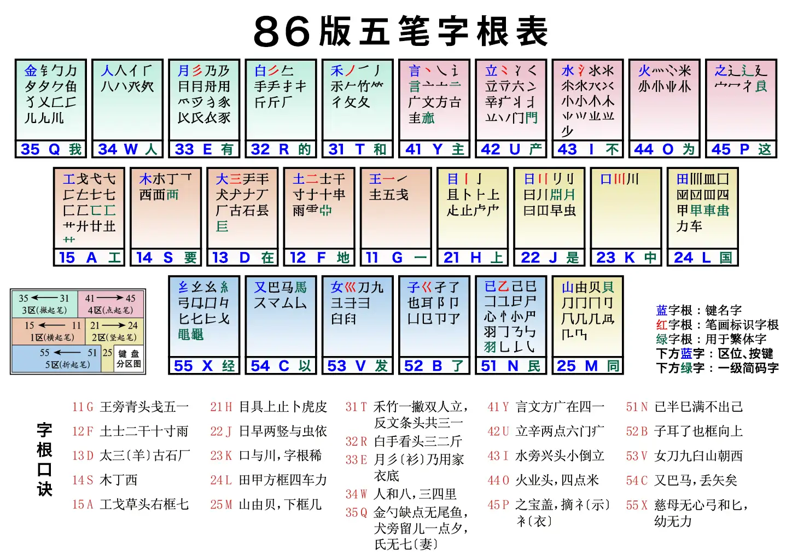
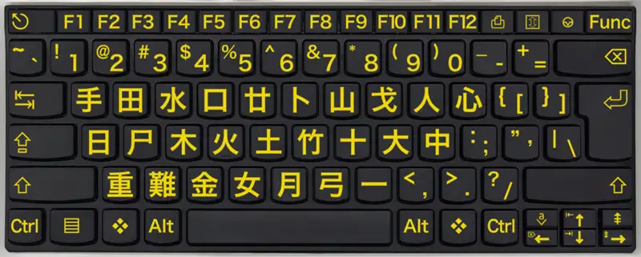
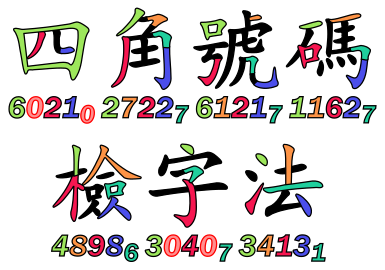

在中文 PH 里与中文相关的代码自然是特色。

## 拼音

汉语拼音是用拉丁字母来表示普通话读音的方法，规范来自[《汉语拼音方案》](http://www.moe.gov.cn/ewebeditor/uploadfile/2015/03/02/20150302165814246.pdf)。你可以从新华字典的附录中找到这份方案的内容。

### 声母表

<table class="chinese-encoding-table wikitable">
<tbody>
<tr>
<td width="50px">字母</td>
<td width="50px"><b>b</b></td>
<td width="50px"><b>p</b></td>
<td width="50px"><b>m</b></td>
<td width="50px"><b>f</b></td>
<td width="50px"><b>d</b></td>
<td width="50px"><b>t</b></td>
<td width="50px"><b>n</b></td>
<td width="50px"><b>l</b></td></tr>
<tr>
<td>发音</td>
<td><b>ㄅ</b> 玻</td>
<td><b>ㄆ</b> 坡</td>
<td><b>ㄇ</b> 摸</td>
<td><b>ㄈ</b> 佛</td>
<td><b>ㄉ</b> 得</td>
<td><b>ㄊ</b> 特</td>
<td><b>ㄋ</b> 讷</td>
<td><b>ㄌ</b> 勒</td></tr>
<tr>
<td width="50px">字母</td>
<td width="50px"><b>g</b></td>
<td width="50px"><b>k</b></td>
<td width="50px"><b>h</b></td>
<td width="50px"></td>
<td width="50px"><b>j</b></td>
<td width="50px"><b>q</b></td>
<td width="50px"><b>x</b></td>
<td width="50px"></td></tr>
<tr>
<td>发音</td>
<td><b>ㄍ</b> 哥</td>
<td><b>ㄎ</b> 科</td>
<td><b>ㄏ</b> 喝</td>
<td></td>
<td><b>ㄐ</b> 基</td>
<td><b>ㄑ</b> 欺</td>
<td><b>ㄒ</b> 希</td>
<td></td></tr>
<tr>
<td width="50px">字母</td>
<td width="50px"><b>zh</b></td>
<td width="50px"><b>ch</b></td>
<td width="50px"><b>sh</b></td>
<td width="50px"><b>r</b></td>
<td width="50px"><b>z</b></td>
<td width="50px"><b>c</b></td>
<td width="50px"><b>s</b></td></tr>
<tr>
<td>发音</td>
<td><b>ㄓ</b> 知</td>
<td><b>ㄔ</b> 蚩</td>
<td><b>ㄕ</b> 诗</td>
<td><b>ㄖ</b> 日</td>
<td><b>ㄗ</b> 资</td>
<td><b>ㄘ</b> 雌</td>
<td><b>ㄙ</b> 思</td></tr>
</tbody></table>

### 韵母表

<table class="chinese-encoding-table wikitable">
<tbody><tr>
<th>
</th>
<th>开口呼</th>
<th>齐齿呼</th>
<th>合口呼</th>
<th>撮口呼</th></tr>
<tr>
<th rowspan="6" style="background-color: #e6e6fa;">单 元 音 韵 母</th>
<td width="23%">空韵 ㄭ 师</td>
<td width="23%">i / yi 丨 衣</td>
<td width="23%">u / wu ㄨ 乌</td>
<td width="23%">ü / yu ㄩ 迂</td></tr>
<tr>
<td>a ㄚ 啊</td>
<td>ia / ya 丨ㄚ 呀</td>
<td>ua / wa ㄨㄚ 蛙</td>
<td style="background-color: #ccc;"></td></tr>
<tr>
<td>o ㄛ 喔</td>
<td style="background-color: #ccc;">
</td>
<td>uo / wo ㄨㄛ 窝</td>
<td style="background-color: #ccc;">
</td></tr>
<tr>
<td>e ㄜ 鹅</td>
<td style="background-color: #ccc;"></td>
<td style="background-color: #ccc;"></td>
<td style="background-color: #ccc;"></td></tr>
<tr>
<td>ê ㄝ 诶</td>
<td>ie / ye 丨ㄝ 耶</td>
<td style="background-color: #ccc;"></td>
<td>üe / yue ㄩㄝ 约</td></tr>
<tr>
<td>er ㄦ 儿</td>
<td style="background-color: #ccc;"></td>
<td style="background-color: #ccc;"></td>
<td style="background-color: #ccc;"></td></tr>
<tr>
<th rowspan="4" style="background-color: #e6e6fa;">复 元 音 韵 母</th>
<td>ai ㄞ 哀</td>
<td style="background-color: #ccc;"></td>
<td>uai / wai ㄨㄞ 歪</td>
<td style="background-color: #ccc;"></td></tr>
<tr>
<td>ei ㄟ 诶</td>
<td style="background-color: #ccc;"></td>
<td>uei(ui) / wei ㄨㄟ 威</td>
<td style="background-color: #ccc;"></td></tr>
<tr>
<td>ao ㄠ 熬</td>
<td>iao / yao 丨ㄠ 腰</td>
<td style="background-color: #ccc;"></td>
<td style="background-color: #ccc;"></td></tr>
<tr>
<td>ou ㄡ 欧</td>
<td>iou(iu) / you 丨ㄡ 优</td>
<td style="background-color: #ccc;"></td>
<td style="background-color: #ccc;"></td></tr>
<tr>
<th rowspan="6" style="background-color: #e6e6fa;">带 鼻 音 韵 母</th>
<td>an ㄢ 安</td>
<td>ian / yan 丨ㄢ 烟</td>
<td>uan / wan ㄨㄢ 弯</td>
<td>üan / yuan ㄩㄢ 冤</td></tr>
<tr>
<td>en ㄣ 恩</td>
<td style="background-color: #ccc;"></td>
<td>uen(un) / wen ㄨㄣ 温</td>
<td style="background-color: #ccc;"></td></tr>
<tr>
<td style="background-color: #ccc;"></td>
<td>in / yin 丨ㄣ 因</td>
<td style="background-color: #ccc;"></td>
<td>ün / yun ㄩㄣ 晕</td></tr>
<tr>
<td>ang ㄤ 昂</td>
<td>iang / yang 丨ㄤ 央</td>
<td>uang / wang ㄨㄤ 汪</td>
<td style="background-color: #ccc;"></td></tr>
<tr>
<td>eng ㄥ 亨的韵母</td>
<td>ing / ying 丨ㄥ 英</td>
<td>ueng / weng ㄨㄥ 翁</td>
<td style="background-color: #ccc;"></td></tr>
<tr>
<td>ong ㄨㄥ 轰的韵母</td>
<td>iong / yong ㄩㄥ 雍</td>
<td style="background-color: #ccc;"></td>
<td style="background-color: #ccc;"></td></tr>
</tbody></table>

### 拼音：扩展阅读

- Bilibili Siphercase : [重新认识「汉语拼音」](https://www.bilibili.com/video/BV1xY4y137Ew)

## 其他中文读音表示法

汉语拼音是目前中国大陆主要使用的拉丁化读音表示法。在我国部分地区，还会用到比较特殊的读音表示。

### 注音符号

注音符号 (Bopomofo) 诞生于民国时期，目前是我国台湾地区广为流行的读音表示方案。你可以在本章上方的拼音声母、韵母表里找到与汉语拼音对应的注音符号。

#### 注音符号第二式

注音符号第二式，又称国音二式，是台湾在 1980 年代公布的基于注音符号的读音罗马字方案，与汉语拼音类似使用英文字母来表示。

### 威妥玛拼音

威妥玛拼音 (Wade-Giles) 又称韦氏拼音、威翟式拼音，是第一套将汉语拉丁化的方案，在清朝时期便已有之。
威妥玛拼音的特点是使用了非常多的符号，比如用撇号 ' 来表示送气，韵母 ê 等。
比如北京 Pei-ching ，天津 T'ien-chin 等。

威妥玛拼音使用数字 1、2、3、4 标注声调。

#### 邮政式拼音

邮政式拼音是为了迎合二十世纪初期打电报的需要，在威妥玛拼音的基础上，去掉了附加符号的一种拼写法。
就算是现在国内也有很多地方能够看到邮政式拼音留下的遗产，
比如清华大学中清华的拼写 Tsinghua ，北京大学中北京的拼写 Peking ，青岛啤酒中青岛的拼写 Tsingtao 等。

### 拼音、注音、威妥玛转换工具

- [中国哲学书电子化计划：注音转换工具](https://ctext.org/pinyin.pl?if=gb&remap=gb)

### 方言拼音

比较著名的方言拼音包括粤语拼音、吴语拼音等。

#### 粤拼

香港语言学学会粤语拼音方案，简称粤拼，是现在主流的粤语拼音方案。
粤拼的拼音字母是由拉丁字母 a 至 z 组成，其中 q、r、v、x 不用。
粤拼共有 19 个声母和 58 个韵母。字调则以阿拉伯数字 1 至 6 标示。

关于粤拼方案，可以查看这里：[香港語言學學會粵語拼音方案](https://jyutping.org/zh-cmn-hant/jyutping/)

### 反切

反切是用两个汉字给一个汉字注音的方法。两汉字中前一个字取其声母，后一个字取其韵母和声调，拼合出被注音字的读音。(1)
{.annotate}

1. 古代的汉文是竖着写的，因而两个汉字的前一个字通常称为**上字**，而后一个字被称为**下字**。

举例：

- 苏：素姑切。素取声母，姑取韵母和声调。
- 杭：胡郎切。胡取声母，郎取韵母和声调。

需要注意的是，古字典的反切只适用于当时的古音。汉语发展到现在，读音经过了诸多改变，以前制定的反切如今已无法简单套用。

查询古音的网站：[字统网](https://zi.tools/)

## 五笔

五笔又称为**王码**，创作人是王永民，创作于 1983 年。
五笔是作为拼音之外的另一种广为使用的输入法，其特色是能够在不知道汉字读音的情况下也能打出来字，完全依据笔画和字形特征对汉字进行编码。

五笔的核心思想在于**拆字**，将汉字拆成<u>组成汉字</u>的**字根**，然后按笔画顺序依次输入。举例：

- 解：拆分成「⺈」(q)、「用」(e)、「刀」(v)、「⿱𠂉一」、「丨」(h)，一共五个部件，取前三个和最后一个编码，为 qevh 。
- 谜：拆分成「讠」(y)、「米」(o)、「辶」(p)，取三个，加末位识别码「左右末笔为捺」(y)，为 yopy 。

<figure markdown>
  { width="400" }
  <figcaption markdown>五笔字根表[^1]
  </figcaption>
</figure>

以上为 86 版本的五笔字根。在这之后还有「98版」和「新世纪版」两个版本，对少许字根做出了更改，本 Wiki 不进行细述。

五笔输入法解决了过去拼音输入法的一大弊端，即重码数量较多，打一个字的字音可能要翻好几页才能翻到你要的那个字。
五笔输入法的重码率非常低，打字速度很快，因此一度广为传播。
但现如今由于拼音输入法越来越智能，加之五笔输入法的学习门槛较高（需要背会每一个按键对应的字根），年轻一代的中国人更常使用拼音输入法。

[^1]: Cangjie6, [CC BY-SA 4.0](https://creativecommons.org/licenses/by-sa/4.0), via [Wikimedia Commons](https://commons.wikimedia.org/wiki/File:Wubi86_keyboard_layout.png)

### 五笔工具

由五笔输入汉字：

- [便民查询网：在线五笔输入法](https://zaixianwubishuru.bmcx.com/)
- [在线打字吧](http://www.daziba.cn/tools/onlinewbime.aspx)

由汉字反查五笔：

- [范文站](https://www.fanwenzhan.com/wubi/)
- [蛙蛙工具](https://www.iamwawa.cn/wubi.html)

## 仓颉

仓颉输入法的主要受众在广东、香港、台湾等地，在繁体中文的输入法中有着重要的地位。
类似五笔的拆字思想，仓颉输入法也有字根，但字根数为24个，包含「哲理类」、「笔画类」、「人体类」、「字形类」四种类别，以及两个特殊键位 X 和 Z。

<figure markdown>
  { width="400" }
  <figcaption markdown>仓颉键盘[^2]
  </figcaption>
</figure>

[^2]: Cangjie6, Jacek Fink-Finowicki, [CC BY-SA 4.0](https://creativecommons.org/licenses/by-sa/4.0), via [Wikimedia Commons](https://commons.wikimedia.org/wiki/File:BK-YL_Keyboard_CJ.png)

### 仓颉工具

由仓颉输入汉字：

- [便民查询网：在线仓颉输入法](https://cangjieshurufa.bmcx.com/)

由汉字反查仓颉：

- [好工具——仓颉查字](https://cangjie.hao86.com/)

## 四角号码

四角号码的诞生在拼音之前，民国时期作为一种常用检字方案存在。
四角号码检字是将一个字的左上、右上、左下、右下的四个部分摘取出来，
使用一个数字描述每一个部分的方法。有时在最后增加一位补码，称为“附角”，故最多为五码。

<figure markdown>
  { width="300" }
  <figcaption markdown>四角号码检字法[^3]
  </figcaption>
</figure>

[^3]: 159265, [CC BY-SA 3.0](https://creativecommons.org/licenses/by-sa/3.0), via [Wikimedia Commons](https://commons.wikimedia.org/wiki/File:Sijiaohaoma_jianzifa.svg)

### 四角号码工具

- [词典网：四角号码](https://www.cidianwang.com/zd/sijiao.htm)

## 中文电码

在仍然使用电报的时期，通过电报传送中文信息的需要用到中文电码。
中文电码表采用了四位阿拉伯数字作代号，从0001到9999按四位数顺序排列，用四位数字表示最多一万个汉字、字母和符号。

### 中文电码工具

- [便民查询网：中文电码](https://dianma.bmcx.com/)

## 通用规范汉字表

《通用规范汉字表》是教育部发布的一份表格，收集了8105个常用的汉字，分为一、二、三级，根据使用度进行排列。

获取地址：

- [教育部官网](http://www.moe.gov.cn/jyb_sjzl/ziliao/A19/201306/t20130601_186002.html)
- [复旦大学镜像](https://jwc.fudan.edu.cn/_upload/article/files/73/dc/4f1e8c94471ab89b7e14b7b9b70a/347348f7-ab66-49c7-bd76-f2a5df517d35.pdf)
- [维基文库](https://zh.wikisource.org/wiki/%E9%80%9A%E7%94%A8%E8%A7%84%E8%8C%83%E6%B1%89%E5%AD%97%E8%A1%A8)
