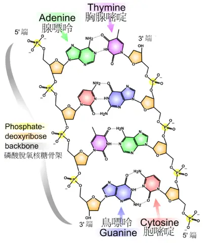

!!! tip ""

    本页内容涉及到高中生物，无法详尽解释相关所有名词。本页仅考虑相关内容在 PuzzleHunt 中的内容。

    关于本页所涉及名词的详细知识与定义，请参考其他百科或高中生物教材。

## DNA

**脱氧核糖核酸** (DNA) 是承载着生物**遗传信息**的一条分子链。DNA 的特点是双螺旋结构。

<figure markdown>
  { width="300" }
  <figcaption markdown>DNA 的双螺旋结构</figcaption>
</figure>

DNA 的基本单位是核苷酸，在每个核苷酸上都连着一个**碱基**。
如图所示，你可以看到 DNA 中存在四种碱基，分别叫做腺嘌呤、鸟嘌呤、胞嘧啶、胸腺嘧啶。它们分别用英文字母 **AGCT** 来表示。

DNA 的每一条分子链上的分子都能够在它的另一条链上找到与之匹配的对应分子。腺嘌呤 (A) 与胸腺嘧啶 (T) 配对，鸟嘌呤 (G) 与胞嘧啶 (C) 配对。

### DNA 密码子

在 PuzzleHunt 里，有一种使用三个连续的 DNA 碱基表示字母的方法，便是 DNA 密码子。每三个密码子组成一种氨基酸，而这些氨基酸用于描述遗传所需要的信息。

一共有 20 种不同的氨基酸，每一种都由一个英文字母表示。除了氨基酸外，还有一个特殊的密码子 ATG 用于表示开始，三个特殊的密码子用于表示结束。

| 氨基酸 |            密码子            |   缩写   | 氨基酸 |            密码子            |   缩写   |
|:------:|:----------------------------:|:--------:|:------:|:----------------------------:|:--------:|
|  Ala/A | GCT、GCC、GCA、GCG           | GCN      |  Leu/L | TTA、TTG、CTT、CTC、CTA、CTG | YTR、CTN |
|  Arg/R | CGT、CGC、CGA、CGG、AGA、AGG | CGN、MGR |  Lys/K | AAA、AAG                     | AAR      |
|  Asn/N | AAT、AAC                     | AAY      |  Met/M | ATG                          |          |
|  Asp/D | GAT、GAC                     | GAY      |  Phe/F | TTT、TTC                     | TTY      |
|  Cys/C | TGT、TGC                     | TGY      |  Pro/P | CCT、CCC、CCA、CCG           | CCN      |
|  Gln/Q | CAA、CAG                     | CAR      |  Ser/S | TCT、TCC、TCA、TCG、AGT、AGC | TCN、AGY |
|  Glu/E | GAA、GAG                     | GAR      |  Thr/T | ACT、ACC、ACA、ACG           | ACN      |
|  Gly/G | GGT、GGC、GGA、GGG           | GGN      |  Trp/W | TGG                          |          |
|  His/H | CAT、CAC                     | CAY      |  Tyr/Y | TAT、TAC                     | TAY      |
|  Ile/I | ATT、ATC、ATA                | ATH      |  Val/V | GTT、GTC、GTA、GTG           | GTN      |
|  起始  | ATG                          |          |  终止  | TAA、TGA、TAG                | TAR、TRA |

## RNA

核糖核酸 (RNA) 与 DNA 一样传载着遗传信息，与 DNA 各有作用。
与 DNA 不一样之处在于它是单链的，且碱基与 DNA 不完全一致，RNA 的碱基不包括胸腺嘧啶，而是尿嘧啶 (U)。它与腺嘌呤进行配对。

RNA 的密码子表与 DNA 一致，只是把 T 换成了 U。

<figure markdown>
  { width="400" }
  <figcaption markdown>RNA 密码子表</figcaption>
</figure>
