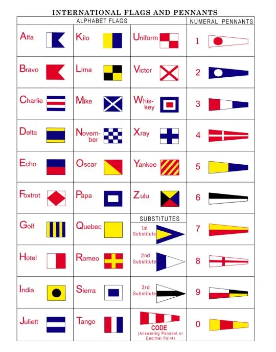

国际信号旗 (International Code of Flags) 是国际信号代码系统 (ICS) 的一种，也是常见的使用旗帜来表示字母的方式，通常在海事中用到。

下图描述了最常见的 26 个英文字母与对应的旗帜关系。旗帜左边的单词是[北约音标字母](./phonetic-alphabet.md)，取其首字母。

<figure markdown>
  { width="400" }
  <figcaption markdown>国际信号旗</figcaption>
</figure>
