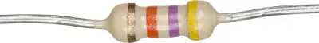

电阻色环是一种使用颜色标注电阻的方法。

<figure markdown>
  { width="400" }
  <figcaption markdown>电阻色环</figcaption>
</figure>

这里我们不去细述通过色环读出电阻数的方法，大多数的 PuzzleHunt 仅会用到将颜色对应到一个数字的情况，见下表：

<table>
    <tr>
        <th>数字</th>
        <th>颜色</th>
        <th>色块</th>
    </tr>
    <tr>
        <td>0</td>
        <td>黑色 (Black)</td>
        <td class="color-block black"></td>
    </tr>
    <tr>
        <td>1</td>
        <td>棕色 (Brown)</td>
        <td class="color-block brown"></td>
    </tr>
    <tr>
        <td>2</td>
        <td>红色 (Red)</td>
        <td class="color-block red"></td>
    </tr>
    <tr>
        <td>3</td>
        <td>橙色 (Orange)</td>
        <td class="color-block orange"></td>
    </tr>
    <tr>
        <td>4</td>
        <td>黄色 (Yellow)</td>
        <td class="color-block yellow"></td>
    </tr>
    <tr>
        <td>5</td>
        <td>绿色 (Green)</td>
        <td class="color-block green"></td>
    </tr>
    <tr>
        <td>6</td>
        <td>蓝色 (Blue)</td>
        <td class="color-block blue"></td>
    </tr>
    <tr>
        <td>7</td>
        <td>紫色 (Violet)</td>
        <td class="color-block violet"></td>
    </tr>
    <tr>
        <td>8</td>
        <td>灰色 (Grey)</td>
        <td class="color-block grey"></td>
    </tr>
    <tr>
        <td>9</td>
        <td>白色 (White)</td>
        <td class="color-block white"></td>
    </tr>
</table>
