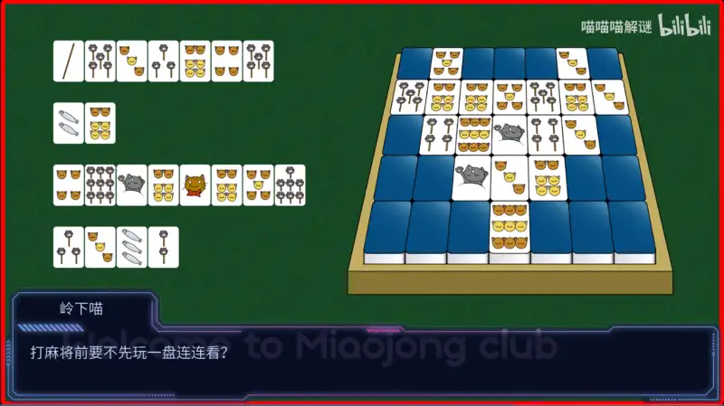
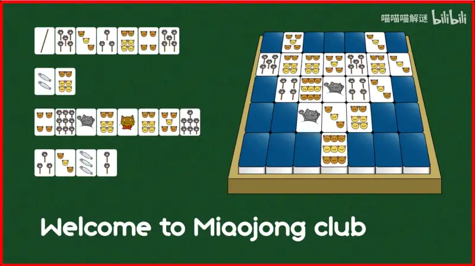

## PH 里的题有什么特点？

本 Wiki 的首页提到，数独是一种经典的谜题。常规的谜题，比如数独、围棋的死活题、填字游戏 (CrossWords) 等，
它们的规则相对统一，并为众人所皆知。但是在 Puzzle Hunt 里，可能会出现相对小众的规则，而这些规则并不会直接告诉玩家。
对于 PH 的谜题，找到线索如何组合的规则也是解谜的一部分。

谜题的规则往往涉及到：

- 多个古典规则的组合，或者在古典规则的基础上添加了特殊限制
- 是较为小众，可能需要在互联网上查找相关的信息
- 生活中的常识
- 一些学术上的知识

由于涉及的规则多种多样，人为设计的谜题往往会存在特殊的线索，或者说**提示 (Hint)** 。这些提示会指引玩家发掘题目中的这些隐藏规则。

## 谜题的三个组成部分

在 PH 中出现的谜题往往包含以下三个组成部分：标题、风味文本、正文[^2]。我们以出现在 Miaohunt 2023 预告片[^1]中的这道《大竹林麻将馆》来做一个例子。

<figure markdown>
  {width="600"}
  <figcaption>《大竹林麻将馆》</figcaption>
</figure>

### 标题 Title

**标题 (Title)** 是指一道谜题的名字，定义了谜题的主题[^2]。

本题的标题为《大竹林麻将馆》，由于特殊的视频载体形式，标题即是该视频分段的标题。
玩家一看便知这道题会与我国的国粹——麻将有关。

### 风味文本 Flavor Text

**风味文本 (Flavor Text，简称 FT )** 是一句比较特殊的话，通常紧跟着标题出现。
风味文本通常包含了题目的规则提示，指点玩家应该朝着什么方向去努力。

本题中的风味文本安排在了对话里面，*“打麻将前要不先玩一把连连看？”*

在这句风味文本里，有一个比较特殊的关键词**连连看**，这意味着这道题很可能在麻将的基础上还会用到连连看的规则。

当然了，由于谜题的特性，风味文本有时并不像这题一样直接告诉你会使用的规则。
但往往风味文本里藏有一些关键词作为暗示，成为找到规则的线索。

!!! note "关于 FT"
    FT 主要起到提示作用，但是不一定每道题都会有 FT 。

    通常，如果谜题设计者认为通过标题和题目正文已经提供了足够多的信息，便不会提供 FT 。

### 正文 Body

**正文 (Body)** 即是题目主体。不同的谜题之间差距会很大。[^2]

在这道题中，正文的内容包括图片上的三个部分：

1. 占地最大的，位于图片右侧的麻将框。
2. 位于左侧的，排成四行的麻将
3. 位于下方的英文 Welcome to Miaojong Club

<figure markdown>
  {width="600"}
  <figcaption>《大竹林麻将馆》</figcaption>
</figure>

解谜玩家需要根据正文中出现的这些线索，加上标题、风味文本所提供的提示，推导出解谜规则。

[^1]: 【MH2023】《喵镇奇谈》MiaoHunt2023预告片 : [https://www.bilibili.com/video/BV1Bu411M7sU](https://www.bilibili.com/video/BV1Bu411M7sU)

[^2]: Puzzle Hunt入门就是这么简单！（上）【上海交大推理协会】 : [https://www.bilibili.com/video/BV1ho4y1P7P6](https://www.bilibili.com/video/BV1ho4y1P7P6)
