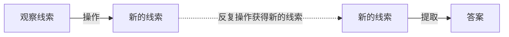
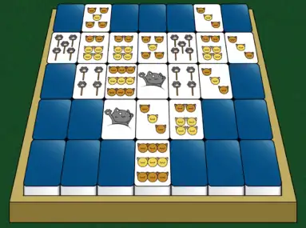

## 我该如何解开一道谜题？

!!! info ""

    本文所述的“谜题”，特指在 Puzzle Hunt 中出现的谜题。

Puzzle Hunt 中的谜题通常包含标题、风味文本、正文三部分。

面对一道题目，我们第一步需要考虑的**寻找题目中的线索**，以及线索之间的**共同之处或结构**，推测出下一步的**操作**。
之后，尝试执行这些**操作**，这些操作往往会带来新的线索。
在反复地执行与获取新的线索后，通过某种**提取方式**，将线索**转化**为一个**最终答案**。[^1]

??? tip "说些人话"

    简单来说，就是先找题目上的信息，根据标题、 FT 、一些关键字推断出这道题的规则，然后运用这个规则将这些信息转化，
    就跟做函数题一样。

    题目中很可能不止一个规则，所以会需要转化好几次。有时候你转化出来的结果也是一条线索或者操作。
    
    最终转化的步骤通常叫做提取。提取完的最终结果就是答案。—— JCarlson

这里我们以前文《Puzzle Hunt 里的谜题》中提到的，出现在 Miaohunt 2023 预告片[^2]中的这道《大竹林麻将馆》来做一个例子，来实际试着解开这道谜题。

<figure markdown>
  {width="600"}
  <figcaption>《大竹林麻将馆》</figcaption>
  <figcaption>FT ：打麻将前要不先玩一把连连看？</figcaption>
</figure>

### 观察 Observation

#### 标题和 FT

观察题目可以从标题和 FT 中找到两个关键词，**麻将**以及**连连看**。

麻将方面，可以看到题目正文里出现的正面朝上的麻将牌，能够大体上分为三个种类：猫爪、猫头、鱼，数量从 1 至 9 不等。
若对麻将有些许了解，应该能反应过来这对应着麻将里的万、筒、索三种类型的数牌，他们也是从 1 至 9 共九种。 (1)
{.annotate}

1. 尽管全国大多数地区的麻将都包含字牌（即东南西北白发中），这里其实有个隐含的线索，题目视频的开头暗示了重庆这座城市。
   在川渝地区，麻将的主流规则是血战到底规则，只用到了万、筒、索这三种数牌，没有字牌。

而连连看方面，我们可以注意到右边的麻将框里有 18 个正面朝上的麻将牌，并且都是成对出现的。
因此这道题很有可能是希望我们使用连连看的规则将这些麻将“消掉”。
需要注意的是，放麻将的框和反面朝上的麻将就像墙一样，消牌时的连线不能经过它们。

#### 正文

除了标题和 FT 提到的两个关键词以外，你应该还发现了题目左侧的四排麻将，它们分别是7张，2张，8张，以及4张。
往下看看，题目里还有一串英文 Welcome to Miaojong Club ，“欢迎来到喵喵麻将俱乐部”。
但这里我们不应关注它的英文意义，而是这串英文的字符数量，可以发现，这串英文的四个单词，字母数分别为7、2、8、4，刚好与四排麻将的数量相同。这样的话，这两个部分应该是有一定联系的。

### 操作 Implementation

题目里的大部分信息都被我们找到，现在可以执行一些题目要求我们做的操作。

#### 麻将

通过左侧麻将牌与下方英文单词之间的关系，我们能够联想到每一张麻将应该对应一个字母，而那四排麻将分别对应那四个单词。
观察到 Welcome 的第二个字母和第七个字母都是 e ，再看到第一排麻将的第二张牌和第七张牌都是“5猫爪”。
这意味着每一张麻将应该对应一个字母的想法应该是正确的。

得到了这层对应关系，我们可以推测“1猫爪”到“9猫爪”分别对应英文字母 a~i ，“1猫头”到“9猫头”分别对应英文字母 j~r ，
而剩下的鱼对应从 s 开始的剩下8个字母。(1)
{.annotate}

1. 说到这里，不知你是否察觉到这道题目左侧四排麻将牌中位于第一排最左侧的那根棍子有些突兀，那根棍子对应的字母是 w 。
   根据我们得到的规律，它应该代表“5鱼”。我们猜测这很可能使用了类似古代中国数筹或算盘一样，逢五便有一个特殊表示，在这里就是串串鱼的棍子。

#### 连连看

第二个操作即是连连看，我们尝试根据连连看的规则消去右边麻将框里这些正面朝上、成对的麻将，会发现由于麻将牌的阻挡，消掉麻将牌的顺序是唯一的。

<figure markdown>
  {width="400"}
  <figcaption>连连看</figcaption>
</figure>

我们可以得到一组消掉麻将牌的顺序：6头、5头、5爪、4爪、6头、3头、3头、1爪、9头。

### 提取 Extraction

通过上面提到的操作，我们得到了两组情报，一个是麻将与英文字母的对应关系，一个是消掉麻将牌的顺序。

这里我们使用对应关系将消掉的牌依次换成英文字母。

| 消掉的牌  | 英文字母 |
| -------- | -------- |
| 6头      | `O`      |
| 5头      | `N`      |
| 5爪      | `E`      |
| 4爪      | `D`      |
| 6头      | `O`      |
| 3头      | `L`      |
| 3头      | `L`      |
| 1爪      | `A`      |
| 9头      | `R`      |

我们最后得到的答案是 `ONE DOLLAR` 。这正是这道谜题的答案。恭喜你，已经成功的解决了一道 Puzzle Hunt 里的谜题！

??? tip "说些人话"

    这道题出自 Miaohunt 2023 的预告片，作为预热而言是一道综合难度较低的题目，这道题也比 Miaohunt 正赛的大部分题目简单。
    正赛里用到的大部分知识将会更加复杂和小众，对新手 Hunter 而言不是特别友好，但是正赛里会提供非常丰富的提示，你通常还会有一些队友跟着你一起做题。
    因此，就算是更加困难的题目，相信你们也会有办法解决。为了增加新 Hunter 的知识储备正是本 Wiki 最重要的目标之一。
    —— JCarlson

[^1]: Puzzle Hunt入门就是这么简单！（上）【上海交大推理协会】 : [https://www.bilibili.com/video/BV1ho4y1P7P6](https://www.bilibili.com/video/BV1ho4y1P7P6)

[^2]: 【MH2023】《喵镇奇谈》MiaoHunt2023预告片 : [https://www.bilibili.com/video/BV1Bu411M7sU](https://www.bilibili.com/video/BV1Bu411M7sU)
